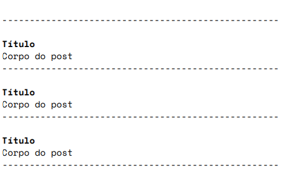

# desafio_flutter_dreamlabs

A new Flutter project.

## Getting Started

Objetivo: Criar um aplicativo simples com acesso à conteúdo
externo.

1. Crie um aplicativo simples para acessar o conteúdo da API:
   https://jsonplaceholder.typicode.com/guidel e listar em uma
   página todos os posts retornados no endpoint
   https://jsonplaceholder.typicode.com/posts no seguinte
   formato:
   

